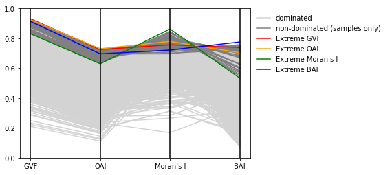
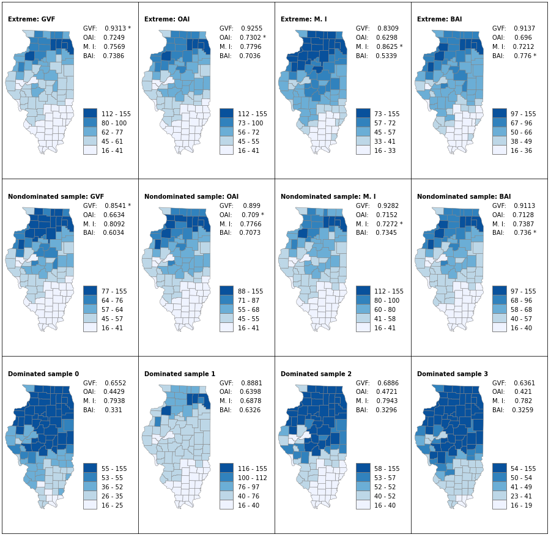

# Exploring the Tradeoffs among Multiple Criteria for Choropleth Maps

This repository includes two Jupyter notebooks and necessary data used in the notebooks. The purpose of these notebooks is to illustrate how to (1) compute all classifications and (2) illustrate how to explore the tradeoffs among these classifications. 

There are more than 3 million possible classifications for the relatively small data sets (with 102 units and 101 unique values). While it is ultimately difficult to show all of them, we can show some important aspects of them. We can first pull out the four best classifications, which exhibiting the highest value in one criterion. We will call these four classifications the *extremes*. We then pull 10,000 random samples from the 3 million and more classifications. Among the samples, we can identify those that are [not dominated](https://en.wikipedia.org/wiki/Multi-objective_optimization) by any other samples. The following shows how these classifications pan out in a parallel coordinate plot, where each line represents a classification that is evaluated using four criteria. Descriptions about these criteria can be found in the paper by [Armstrong, Xiao and Bennett (2003)](https://www.tandfonline.com/doi/full/10.1111/1467-8306.9303005).

It is still difficult to show the maps for the 10,004 classifications (assuming the smaples do not accidently include one of the four extremes, which has a chance smaller than 1 in 300). Instead, below we show the maps for the four extremes (top row), the four extremes in the samples (middle row), and four random dominated classifications (bottom row).

The following notebook details how these plots and maps are made:

- [explore_choropleth_results.ipynb](https://github.com/compgeog/choropleth-tradeoffs/blob/main/explore_choropleth_results.ipynb)

The detailed explanation of how to compute the 3 million and more classifications is presented in the following notebook:

- [explore_choropleth_computation.ipynb](https://github.com/compgeog/choropleth-tradeoffs/blob/main/explore_choropleth_computation.ipynb)

Clicking on the notebooks will preview the content. There are at least two approaches to actually run the notebooks. They can be downloaded to a local computer and run from a Jupyter server there. You can also click on the  button at the top of each notebook to open it Google Colab and run from there (this requires a Google account to run). Please note you may not be able to finish running the first notebook (computation) if you use a free colab plan because it the intensive computation using parallel computing may require resources that exceed what is allocated. 

(N XIAO 2021)
